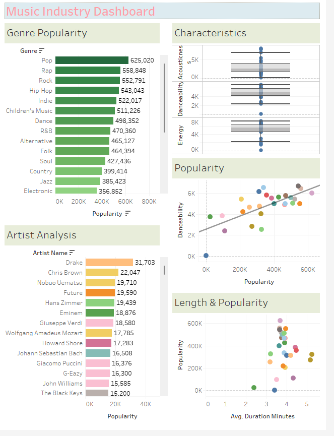

# Data Analysis and Visualisation in Tableau

**Please download the ‘Extension_Task_Spotify Features’ dataset [here.](https://justit831-my.sharepoint.com/:x:/g/personal/danpe_justit_co_uk/Ec-0t9IISK1AsUpLwI0_X9kBLoYwmGqxdTnoCPN4wG5obw?e=6UyUP7)**

**Objectives**

The goal of this analysis is to use the Spotify dataset to uncover trends and key insights that can be valuable for organisations looking to shape future projects, marketing strategies, or product offerings. By examining the data, we aim to identify patterns related to music genres, track characteristics, artist performance, and more, which can inform decision-making for various initiatives.

**Procedure**

Comapre Genre Popularity:

Track Characteristics by Genre: 

Popularity & Other Measures: 

Artist Analysis:

Duration Analysis: 

**Create a Dashboard in Tableau:**

Once the analysis is complete, compile the findings into an interactive and visually appealing dashboard using Tableau. The dashboard should include key visualisations, such as bar charts, scatter plots, and trend lines, that make it easy to explore the relationships between different variables, track characteristics, and overall trends in the Spotify data. This dashboard can serve as a valuable tool for organisations to gain insights and make informed decisions based on the analysis.

**Music Industry Dashboard are here**

**Key findings:**

*	Pop is the most popular music genre, followed by Rap.
  
*	The most popular artist is Drake, closely followed by Chris Brown.
  
*	Songs that are neither too long nor too short tend to be more popular, with the majority of popular genres falling between 3.5 to 4 minutes in length.
  
*	There’s a noticeable cluster of genres with very similar average song lengths.
  
*	Danceability and Acousticness are within a similar range when compared to Energy.

  **Data Source: Just IT, Google, ChatGPT**

**Full Project work book [here.](https://drive.google.com/file/d/18JYYX1Wm92OAtfx7rrz3DH2dlfAz3KVB/view?usp=drive_link)** 

**Click [here](https://github.com/Alamin-analyser/Data-visualisation-in-Tableau-Health-Survey) to see another Tableau Project.**
  

